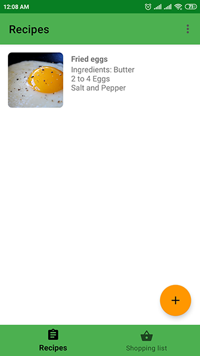

HungryApp
=====================

HungryApp is an open source Android application that allows you to create your own cookbook and
add ingredients to your shopping list straight from a recipe with one click.

The app is written in Kotlin and the following libraries have been used: 
[Room](https://developer.android.com/topic/libraries/architecture/room), 
[RxJava 2](https://github.com/ReactiveX/RxJava), 
[Butter Knife](https://jakewharton.github.io/butterknife/), 
[Navigation component](https://developer.android.com/guide/navigation), 
[Dagger 2](https://github.com/google/dagger), 
[Glide](https://github.com/bumptech/glide), 
[Material Dialogs](https://github.com/afollestad/material-dialogs)

Translations
---

Current languages:

 - Russian
 - English

Screenshots
---

  
 

License
---

    Copyright (C) 2019 Dmitry Kuznetsov <mrbinwin@gmail.com>
    This file is part of HungryApp.
    HungryApp is free software: you can redistribute it and/or modify
    it under the terms of the GNU General Public License as published by
    the Free Software Foundation, either version 3 of the License, or
    (at your option) any later version.
    This program is distributed in the hope that it will be useful,
    but WITHOUT ANY WARRANTY; without even the implied warranty of
    MERCHANTABILITY or FITNESS FOR A PARTICULAR PURPOSE.  See the
    GNU General Public License for more details.
    You should have received a copy of the GNU General Public License
    along with this program.  If not, see <http://www.gnu.org/licenses/>.